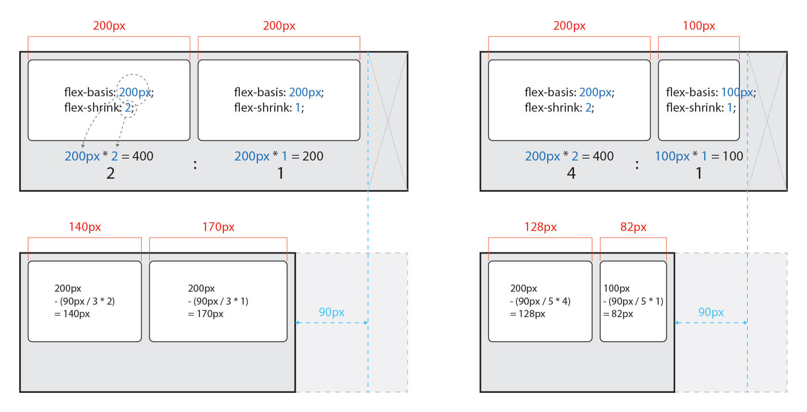

# FLEX - Items

Flex Items를 위한 속성들은 다음과 같습니다.

| **속성** | **의미** |
| :--- | :--- |
| order | Flex Item의 순서를 설정 |
| flex | **flex-grow**, **flex-shrink**, **flex-basis**의 단축 속성 |
| flex-grow | Flex Item의 증가 너비 비율을 설정 |
| flex-shrink | Flex Item의 감소 너비 비율을 설정 |
| flex-basis | Flex Item의 \(공간 배분 전\) 기본 너비 설정 |
| align-self | 교차 축\(cross-axis\)에서 Item의 정렬 방법을 설정 |


### **order**

Item의 순서를 설정합니다.

Item에 숫자를 지정하고 숫자가 클수록 순서가 밀립니다.

음수가 허용됩니다.

> HTML 구조와 상관없이 순서를 변경할 수 있기 때문에 유용합니다.

| **값** | **의미** | **기본값** |
| :--- | :--- | :--- |
| 숫자 | Item의 순서를 설정 | **0** |

```css
order: 순서; 
```


### **flex**

Item의 너비\(증가, 감소, 기본\)를 설정하는 단축 속성입니다.

| **값** | **의미** | **기본값** |
| :--- | :--- | :--- |
| flex-grow | Item의 증가 너비 비율을 설정 | **0** |
| flex-shrink | Item의 감소 너비 비율을 설정 | **1** |
| flex-basis | Item의 \(공간 배분 전\) 기본 너비 설정 | **auto** |

```css
flex: 증가너비 감소너비 기본너비;

.item { flex: 1 1 20px; /* 증가너비 감소너비 기본너비 */ 
flex: 1 1; /* 증가너비 감소너비 */ 
flex: 1 20px; /* 증가너비 기본너비 (단위를 사용하면 flex-basis가 적용됩니다) */ }
```

**flex-grow**를 제외한 개별 속성은 생략할 수 있습니다.

만약 **flex: 1;**로 작성하면 **flex-grow: 1;**과 같습니다.

그러면 나머지 속성은 생략했으니 기본값이 적용되어 **flex-shrink: 1;**, **flex-basis: auto;**가 되겠죠?

즉 **flex: 1;** 혹은 **flex: 1 1;**은 **flex: 1 1 auto;**와 같다고 볼 수 있습니다만 그렇지 않습니다.

**flex-basis**의 기본값은 **auto**입니다만 단축 속성인 **flex**에서 그 값을 생략할 경우 **0**이 적용됩니다.

다시 정리하면 **flex: 1;** 혹은 **flex: 1 1;**은 **flex: 1 1 0;**이 된다는 것입니다.

이 부분을 기억하지 않으면 엉뚱한 결과가 나올 수 있으니 주의합시다!


### **flex-grow**

Item의 증가 너비 비율을 설정합니다.

숫자가 크면 더 많은 너비를 가집니다.

Item이 가변 너비가 아니거나, 값이 **0**일 경우 효과가 없습니다.

| **값** | **의미** | **기본값** |
| :--- | :--- | :--- |
| 숫자 | Item의 증가 너비 비율을 설정 | **0** |

```css
flex-grow: 증가너비; 
```

모든 Items의 총 증가 너비\(**flex-grow**\)에서 각 Item의 증가 너비의 비율 만큼 너비를 가질 수 있습니다.

예를 들어 Item이 3개이고 증가 너비가 각각 **1**, **2**, **1**이라면,

첫 번째 Item은 총 너비의 25%\(1/4\)을,

두 번째 Item은 총 너비의 50%\(2/4\)를,

세 번째 Item은 총 너비의 25%\(1/4\)을 가지게 됩니다.


### **flex-shrink**

Item이 감소하는 너비의 비율을 설정합니다.

숫자가 크면 더 많은 너비가 감소합니다.

Item이 가변 너비가 아니거나, 값이 **0**일 경우 효과가 없습니다.

| **값** | **의미** | **기본값** |
| :--- | :--- | :--- |
| 숫자 | Item의 감소 너비 비율을 설정 | **1** |

```css
flex-shrink: 감소너비; 
```

감소 너비\(**flex-shrink**\)는 요소의 너비에 영향을 받기 때문에 계산하기 까다롭습니다.

영향을 받는다는 요소의 너비는 **width**, **height**, **flex-basis** 등으로 너비가 지정된 경우를 의미합니다.

Container의 너비가 줄어 Items의 너비에 영향을 미칠 경우, 영향을 미치기 시작한 지점부터 줄어든 거리 만큼 감소 너비 비율에 맞게 Item의 너비가 줄어듭니다.

예를 들어 Container의 너비가 줄어 Item의 너비에 영향을 미치기 시작한 지점부터 실제 줄어든 거리가 **90px**일 때,

요소 너비가 같은 Item이 2개이고 지정된 감소 너비가 각각 **2**와 **1**이라면,

감소 너비는 2:1 비율이며,

첫 번째 Item은 **90px**의 2/3인 **60px** 만큼 너비가 감소하고,

두 번째 Item은 **90px**의 1/3인 **30px** 만큼 너비가 감소합니다.

다른 예시로 Container의 너비가 줄어 Item의 너비에 영향을 미치기 시작한 지점부터 실제 줄어든 거리가 **90px**일 때,

요소 너비가 다른 Item이 2개이고 요소 너비는 각각 **200**과 **100**이고,

지정된 감소 너비가 각각 **2**와 **1**이라면,

**200 x 2 = 400**과 **100 x 1 = 100** 즉 감소 너비는 4:1 비율이며,

첫 번째 Item은 **90px**의 4/5인 **72px** 만큼 너비가 감소하고,

두 번째 Item은 **90px**의 1/5인 **18px** 만큼 너비가 감소합니다.




### **flex-basis**

Item의 \(공간 배분 전\) 기본 너비를 설정합니다.

값이 **auto**일 경우 **width**, **height** 등의 속성으로 Item의 너비를 설정할 수 있습니다.

하지만 단위 값이 주어질 경우 설정할 수 없습니다.

| **값** | **의미** | **기본값** |
| :--- | :--- | :--- |
| auto | 가변 Item과 같은 너비 | **auto** |
| 단위 | px, em, cm 등 단위로 지정 |  |

```css
flex-basis: 기본너비; 
```

 **flex** 속성에서 설명한 것 같이 단축 속성 내에서 **flex-basis**를 생략하면 값이 **0**이 되는 것을 주의합시다.


### **align-self**

교차 축\(cross-axis\)에서 개별 Item의 정렬 방법을 설정합니다.

**align-items**는 Container 내 모든 Items의 정렬 방법을 설정합니다.

필요에 의해 일부 Item만 정렬 방법을 변경하려고 할 경우 **align-self**를 사용할 수 있습니다.

이 속성은 **align-items** 속성보다 우선합니다.

| **값** | **의미** | **기본값** |
| :--- | :--- | :--- |
| auto | Container의 **align-items** 속성을 상속받음 | **auto** |
| stretch | Container의 교차 축을 채우기 위해 Item을 늘림 |  |
| flex-start | Item을 각 줄의 시작점\(flex-start\)으로 정렬 |  |
| flex-end | Item을 각 줄의 끝점\(flex-end\)으로 정렬 |  |
| center | Item을 가운데 정렬 |  |
| baseline | Item을 문자 기준선에 정렬 |  |

```css
align-self: 정렬방법; 
```


###  **참고 자료\(References\)**

{% embed url="https://developer.mozilla.org/ko/docs/Web/CSS/CSS\_Flexible\_Box\_Layout/Flexbox%EC%9D%98\_%EA%B8%B0%EB%B3%B8\_%EA%B0%9C%EB%85%90" %}

