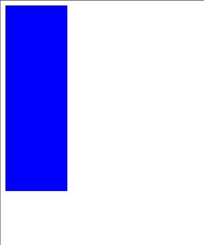

# 반응형

### @media

다양한 미디어 유형이나 장치에 따라, 서로 다른 스타일 규칙을 적용

```css
@media 미디어타입 and (미디어특성){
 css코드
}
```

아래와 같이 적용할 수 있다.

```css
@media screen and (max-width: 1200px){
 body{
 color:red;
 }
}
```


### 미디어 타입

| type | 의 | 기본값 |
| :--- | :--- | :--- |
| all | 모든 미디어 타입에 적용 | all |
| screen | 컴퓨터,태블릿,스마트폰 등 |  |
| print | 인쇄 전용 |  |

기본값은 all이기 때문에 아래와 같이 적용가능

```css
@media (max-width: 1200px){
 body{
 color:red;
 }
}
```

### 

### 특성 

| 특성 | 의미 |
| :--- | :--- |
| width | 뷰포트 가로 너비 |
| max-width | 뷰포트 최대 가로 너비\(이하\) |
| min-width | 뷰포트 최소 가로 너비\(이상\) |
| height | 뷰포트 세로 너비 |
| max-height | 뷰포트 최대 세로 너비\(이하\) |
| min-height | 뷰포트 최 세로 너비\(이상\) |
| orientation | 뷰포트 방향\(portrait , landscape\) |
| 기타.. | 등등.. |


아래의 예제를 살펴봐 주세요

```css
<div class="container"></div>

css
.container{
  width: 100px;
  height: 100px;
  background: tomato;
}
@media screen and (max-width:700px){
  .container{
    height: 300px;
    background: blue;
  }
}
```




max-width를 min-width 로 바꿔주면 반대의 효과가 나타나게 됩니다.

orientation

```css
@media screen and (orientation: portrait ){
  .container{
    height: 300px;
    background: blue;
  }
}
```


```css
orientation: portrait
```

portrait은 세로가 더 길면 즉 일반 스마트폰 상태일때의 내용을 설정합니다.


```css
orientation: landscape
```

landscape는 스마트폰을 눕혔을때와 같은 상황을 설정합니다.


추가적으로 미디어쿼리같은 경우에는 보통 아래와 같이 생략해서 사용합니다.

```css
@media (max-width:700px){
  .container{
    height: 300px;
    background: blue;
  }
}
```


어느 기기를 지원할지는 보통 기획단계에서 정하지만 보통 아래와 같은 형태로 많이 사용합니다.

### Media\(Grid\) options

> 디바이스 종류에 따른 단위는 '기획 / 디자인' 단계에서 결정하는 것이 효과적입니다.

| 종류 | 디바이스 | 단위\(px\) |
| :--- | :--- | :--- |
| Large Devices | Desktops | 1024px 이상 |
| Medium Devices | Tablets | 1024px 이하 |
| Small Devices | Tablets + Phones | 768px 이하 |

BootStrap 에서는 아래와 같이 기준을 정하고 있습니다.

### Grid options <a id="grid-options"></a>

While Bootstrap uses `em`s or `rem`s for defining most sizes, `px`s are used for grid breakpoints and container widths. This is because the viewport width is in pixels and does not change with the [font size](https://drafts.csswg.org/mediaqueries-3/#units).

See how aspects of the Bootstrap grid system work across multiple devices with a handy table.

|  | Extra small &lt;576px | Small ≥576px | Medium ≥768px | Large ≥992px | Extra large ≥1200px |
| :--- | :--- | :--- | :--- | :--- | :--- |
| Max container width | None \(auto\) | 540px | 720px | 960px | 1140px |
| Class prefix | `.col-` | `.col-sm-` | `.col-md-` | `.col-lg-` | `.col-xl-` |
| \# of columns | 12 |  |  |  |  |
| Gutter width | 30px \(15px on each side of a column\) |  |  |  |  |
| Nestable | Yes |  |  |  |  |
| Column ordering | Yes |  |  |  |  |


추가적으로 css에 media query를 작성하기 보다는 html상에서 불러올때

아래와 같이 작성함을 통해 미디어 쿼리를 적용시킬 수 있습니다.

```css
<link
      rel="stylesheet"
      media="(max-width: 1024px)"
      href="./css/main_medium.css"
/>
<link
      rel="stylesheet"
      media="(max-width: 768px)"
      href="./css/main_small.css"
/>
```

이러면 파일을 분할시켜서 더 관리하기 수월합니다.

